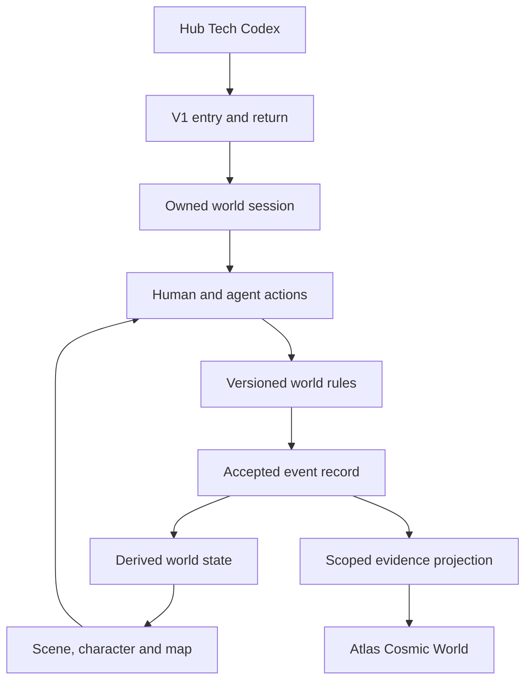

# V1 — the first bounded playable world

Origin: Jarrod Cobb's direction, 7 October 2026, Brisbane. Standing: incubation architecture map and decision record, not a deployed world. Hub Tech Codex is the public discovery face. Product state remains with its owning world engine; Atlas retains its stewardship/federation responsibilities. This document imports no proprietary implementation.

## Genre as requirements and constraints

Sword Art Online and the broader immersive alternate-reality/RPG genre supply inspiration: inhabitable space, persistent identity, embodied interaction, progression, forging, magic, discovery, social play and unusually consequential events. They do not select a hardware vendor, grant rights to fictional assets, or require plots now. Pods and immersive glasses are not current prerequisites. Browser/phone must form a coherent playable surface before an immersive adapter is selected.

The first two environments are distinct: Atlas Cosmic World projects the architecture and its event/relationship evidence; V1 is an experiential domain with its own rules. A1-A1 remains active and perspective-dependent; neither this map nor a product name resolves its classification. The two-arm reconciliation model is a proposed relationship process, not a geometry shortcut to causal truth.

## Architecture that the rendering must expose

Each arrow is a proposed interface, not an installed connection. Browser, phone and later immersive clients render the same authoritative state. An agent submits world actions through its permitted interface; it does not receive host or Atlas authority by inhabiting V1. The renderer cannot award progression or mutate a run directly. Reuse the existing owner's event/replay path; do not introduce a second kernel, ledger or game engine during integration.

| Rendered structure | State it represents | First acceptance |
| --- | --- | --- |
| Entry and twin greeting | destination, session standing, return context | explicit Enter/Leave; failed admission leaves no session |
| Character creation and sheet | appearance/preferences, abilities, progression, inventory | character identity distinct from account and permissions; creation slice inspected before extension |
| World map and local scene | stable place IDs, adjacency, traversal conditions, occupants | tap/select plus readable list; same reachable places across clients |
| Forge/workshop | recipes, inputs, tools, attempts, outputs | no duplicate output or consumption on retry; attributable craft result |
| Magic and ability surfaces | system rules, costs, requirements, effects | valid targeting, bounded costs, explicit interaction rules |
| Encounter/training surface | action opportunities, observations, outcomes | no progression from a rejected action; human and agent actions traceable |
| Evidence/continuity surface | accepted events, receipts, unresolved comparisons | replay returns the same rule-versioned state |

These are semantic map structures. Their table is not a commitment to a geographic layout, named kingdoms or a quest plot. The first spatial layout should derive from existing scene/place identities. Undeclared paths stay absent; synthetic design nodes must be labelled.

## Rules, physics and extraordinary outcomes

The owner must distinguish mechanical physics (movement/collision/time), authored game rules (magic/crafting/progression), and presentation (particles/audio/camera). A physics engine does not decide magical causality, promotion or permission. Optional continuous movement must not turn visual frames into the authoritative turn clock.

An accepted transition is conceptually `next = apply(prior, permittedAction, rulesVersion, recordedDraws)`. This is a design constraint, not a replacement engine API. Its event preserves inputs, rule/content versions and consequential draws. Retries apply once. Invalid actions, stale state, missing prerequisites, malformed values and quota exhaustion produce explicit refusals rather than partial writes. Snapshot repair surfaces divergence.

Protagonist-scale outcomes may be rare but legal. Their prerequisites, costs, probability or deterministic conditions and consequences must be represented in rules. A spectacular animation cannot justify an undeclared exception. Duplication, negative/NaN resources, impossible inventory, race-won rewards, client-authored progression and silent state corruption are defects. Zero bugs cannot be promised; invalid transitions must be detected, bounded and repaired with source history retained.

## Progression and systems of practice

The author's direction is that effort matters. The implementation proposal is to award progression from accepted, attributable practice outcomes, not time online, spending or raw repetition alone. Useful effort may include discovery, skillful application, crafting, cooperation and failed attempts that produce a declared learning result. Reward definitions, repetition limits and challenge calibration need explicit versions. An in-world reward is not an assessment of human worth or an Atlas governance promotion.

Magic, forging and other practices can coexist. Relationships between practices are typed:

- `composes_with`: an explicit combined recipe/action with requirements and consequences.
- `affinity_with`: conceptual or mechanical synergy; does not itself merge rule systems.
- `opposes`: declared interference/counteraction under named conditions, not permanent exclusion.
- `requires`: a prerequisite for a particular transition, not universal hierarchy.

Links require source rules and direction. Reciprocal viewing does not automatically make effects symmetric. Unknown interactions stay unknown; rendering an affinity line never enables an undeclared combined ability. Start with one auditable progression loop and one forging/magic interaction before expanding catalogues.

## Sustainable transitions and reciprocal operation

For every class/state transition record entry conditions, costs, expected consequences, persistence/reversibility, recovery path and observation scope. Sustainability can be estimated as a vector: host compute/storage/network cost, participant burden, replenishment/resource balance, maintainability and privacy/rights impact. No single score establishes sustainability. Unmeasured dimensions are unknown; costs can change with scale and workload.

Commercial direction: cover operating costs, keep the founder margin small, seek broad accessible use and avoid extraction. Exact prices, subsidies and margin remain undecided until workload/unit costs are measured. Contribution, use and payment do not transfer ownership of a participant's work. Preserve attribution, export/exit paths and bounded data retention. Proposed defaults: no sale of personal data, no paid mechanical power advantage, no required behavioural manipulation to fund the world. These defaults are design proposals, not claims that a billing system exists. External maintainers' licences, notices and separately licensed assets remain intact.

## Decisions and what needs the author

| Question | Standing | Next action |
| --- | --- | --- |
| Cosmic World versus V1 | author-directed separate environments | keep source ownership and navigation boundaries explicit |
| V1 human participation | author-directed capacity for the author to play | inspect character slice; prove one owned human session |
| Twin greeting | author-directed V1 entrance | retain lines; animation deferred |
| Effort-sensitive progression | author-directed principle | propose one replayable practice/reward loop |
| Exceptional outcomes | author-directed valid possibilities | declare conditions rather than runtime bypasses |
| Magic/forging crossover | author-directed capability | versioned composition/affinity/opposition rules |
| Browser/phone first | implementation proposal consistent with available devices | render same place graph and action state |
| Session, replay and idempotency | reuse existing owner | verify scoped admission and concurrent-write behaviour |
| 3D renderer and multiplayer transport | candidate shortlist, not selected | bounded compatibility/performance probes before install |
| Mass human participation | explicitly undecided | author decision after single-session proof |
| Death, loss, reset, PvP and irreversible consequences | deferred | author decision before mechanics depend on them |
| Exact progression curves and scarcity | deferred | measurable prototype and author review |
| World geography, named cultures and plots | deferred | do not prebuild lore to hide missing mechanics |
| Agent transfer out of V1/A1-A1 | unresolved authority/perspective matters | existing owners and author; world level grants no external authority |
| Prices, margin and cross-subsidy | author principle, amounts undecided | measured costs and author decision |
| Glasses/pods and interaction mode | device deferred | identify actual hardware; probe capability and comfortable fallback |

## Next slices

1. Inspect and inventory the existing character creation, scene graph and action catalogue; preserve made decisions with source references and explicit missing items.
2. One playable owned session: Enter → character selection/creation → local map → one accepted action → event → replay after restart → Leave/return.
3. One practice/progression loop and one craft/ability composition with retry, conflict, invalid-state and bounded resource checks.
4. One 3D scene adapter over the same state; phone performance and readable non-3D fallback before an immersive device.
5. Agent participation with isolation and lifecycle proof; expand systems after the first loop exposes its constraints.

See [public reuse candidates](PUBLIC-REUSE.md), [machine-readable architecture map](../../data/v1-architecture.json) and [Cosmic substrate receipt](../receipts/2026-10-07-substrate.md). This map starts decisions; it does not mark these slices implemented.
